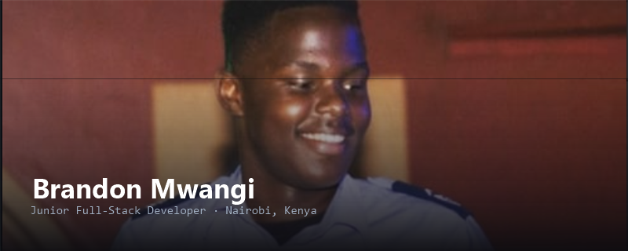

<div align="center">




<br/>

<a href="mailto:mwangibrandon2@gmail.com">
  
</a>
<a href="https://www.linkedin.com/in/brandon-mwangi/">
  
</a>
<a href="https://muraguribrandon.vercel.app">
  
</a>
<a href="https://wa.me/254745549558">
  
</a>

</div>

<br/>

## About

I'm a junior full-stack developer based in Kenya, focused on building clean, functional web applications with TypeScript and Next.js. I started with vanilla HTML/CSS/JS, moved into structured TypeScript projects and Java, and now build most of my work on the React/Next.js stack — taking projects from a rough idea to a deployed, working product.

**Currently:** open to internship, junior developer, or freelance work. Comfortable working solo or as part of a team, and quick to pick up a new codebase.

<br/>

### 🎯 Quick facts

- 📍 Based in Nairobi, Kenya — open to remote work
- 🛠️ `[ X ]` projects shipped, from concept to deployment
- 📚 Microsoft Learn Student Ambassador — completed training program
- 💬 Comfortable async — clear written updates, documented code
- ⏱️ Available `[ full-time / part-time / freelance — pick what's true ]`

<br/>

## Tech Stack

**Languages & Core**


**Frameworks & Tools**


<br/>

## How I Work

- **I ship, not just tinker.** Every project below is a working, deployed application — not a tutorial clone left half-finished.
- **I write for the next person.** Code is commented and structured so someone else could pick it up without a walkthrough.
- **I communicate early, not just at the end.** If I'm blocked or a requirement is unclear, I ask — I don't guess and hand back the wrong thing.
- **I keep learning deliberately.** `[ e.g. "Currently going deeper on backend architecture and testing" — swap in what's actually true ]`

<br/>

## Projects

Each project links to source. `[ Add a live demo link next to any that are deployed — a working link is worth more to an employer than any description. ]`

| Project | What it does | Stack |
|---|---|---|
| **[House Rental Site](https://github.com/MuraguriBrandon/HOUSE-RENTAL-SITE)** | Property rental platform — listings, search, and rental management, built to handle real property data | TypeScript, HTML, CSS |
| **[Restaurant Website](https://github.com/MuraguriBrandon/Restaurant-Website)** | Fully responsive restaurant site with menu display and an online ordering flow | Next.js, TypeScript, JavaScript |
| **[Car Rental](https://github.com/MuraguriBrandon/Car-rental)** | Vehicle browsing and booking system, built with a focus on clean, intuitive UX | HTML, CSS, JavaScript |
| **[Carwash Project](https://github.com/MuraguriBrandon/carwash-project)** | Service listings, pricing, and booking flow for a local car wash business | HTML, CSS, JavaScript |
| **[RockPaperScissors](https://github.com/MuraguriBrandon/RockPaperScissors)** | Interactive implementation of the classic game, built to practice core Java logic | Java |
| **[MLSA Training](https://github.com/MuraguriBrandon/my-MLSA-training-)** | Coursework and projects from the Microsoft Learn Student Ambassador program | Various |

> 💡 **For employers:** these started as learning projects, but each one is functional end-to-end. I'm actively looking to apply the same skills to real production problems.

<br/>

## GitHub Stats

<div align="center">

</div>

<br/>

## Get in Touch

I'm open to internships, junior roles, and freelance web development work. Feel free to reach out — happy to talk about a project, an opportunity, or just tech in general.

<div align="center">

</div>

<details>
<summary><b>📡 CLICK TO EXPAND :: CURRENT_BUILD_LOG</b></summary>

<br/>

```
[BUILD]    Actively shipping new full-stack projects
[LEARNING] Deepening backend architecture & automated testing
[NEXT]     Expanding into cloud deployment pipelines
```

</details>

<br/>

## ⌁ GITHUB TELEMETRY

<div align="center">


<br/>


<br/><br/>


</div>

<br/>

## ⌁ INITIATE CONTACT

<div align="center">

### 📡 Transmission open. Let's build something.

<a href="mailto:mwangibrandon2@gmail.com"></a>
<a href="https://wa.me/254745549558"></a>

<br/><br/>


</div>
