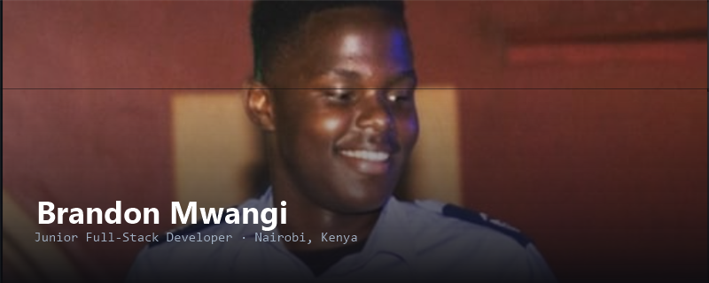

 

 

## About

Hi, I'm Brandon — a junior full-stack developer based in Nairobi, Kenya, with a strong focus on building clean, functional, and user-friendly web applications using TypeScript and Next.js.

I started with HTML, CSS, and JavaScript, then moved into more structured frontend and full-stack work. I enjoy turning product ideas into polished digital experiences, whether that means crafting responsive interfaces, improving usability, or building practical systems that solve real problems.

I’m currently open to internships, junior developer roles, and freelance opportunities. I work well independently and also collaborate effectively within a team.

 

## Quick Facts

| Area | Details |
|---|---|
| Location | Nairobi, Kenya |
| Availability | Open to remote and hybrid opportunities |
| Focus | Frontend, full-stack, responsive web apps |
| Strengths | TypeScript, Next.js, UI/UX, clean architecture |
| Experience | Learning + building real-world side projects |

 

## Tech Stack

### Languages

### Frameworks & Tools

 

## How I Work

- I build with intention. I focus on solving real problems and creating user-friendly interfaces, not just making things look impressive.
- I write maintainable code. I keep projects structured and understandable so they can be extended or handed over cleanly.
- I communicate clearly. If something is unclear or blocked, I ask early instead of guessing.
- I keep improving. Every project is a chance to sharpen my skills in architecture, product thinking, and execution.

 

## Featured Projects

| Project | Description | Stack |
|---|---|---|
| **[House Rental Site](https://github.com/MuraguriBrandon/HOUSE-RENTAL-SITE)** | Property listing and rental management platform designed for browsing, searching, and managing listings efficiently | TypeScript, Next.js, Tailwind |
| **[Restaurant Website](https://github.com/MuraguriBrandon/Restaurant-Website)** | Responsive restaurant website with menu browsing and an online ordering flow | Next.js, TypeScript, JavaScript |
| **[Car Rental](https://github.com/MuraguriBrandon/Car-rental)** | Vehicle booking experience focused on clear browsing, interaction, and smooth UX | HTML, CSS, JavaScript |
| **[Carwash Project](https://github.com/MuraguriBrandon/carwash-project)** | Service listing and booking website for a local business, built around a simple customer flow | HTML, CSS, JavaScript |
| **[RockPaperScissors](https://github.com/MuraguriBrandon/RockPaperScissors)** | Classic game implementation built to practice Java logic and interactive UI patterns | Java |
| **[MLSA Training](https://github.com/MuraguriBrandon/my-MLSA-training-)** | Coursework and projects completed through the Microsoft Learn Student Ambassador training program | Various |

> 💡 I’m building practical, end-to-end projects that reflect real product thinking, clean implementation, and the ability to ship working software.

 

## GitHub Stats

  

 

  

 

  

 

## Let's Connect

I’m open to internships, junior roles, freelance work, and collaboration opportunities. If you’re building something interesting or have a role that could be a fit, I’d love to hear from you.

 

